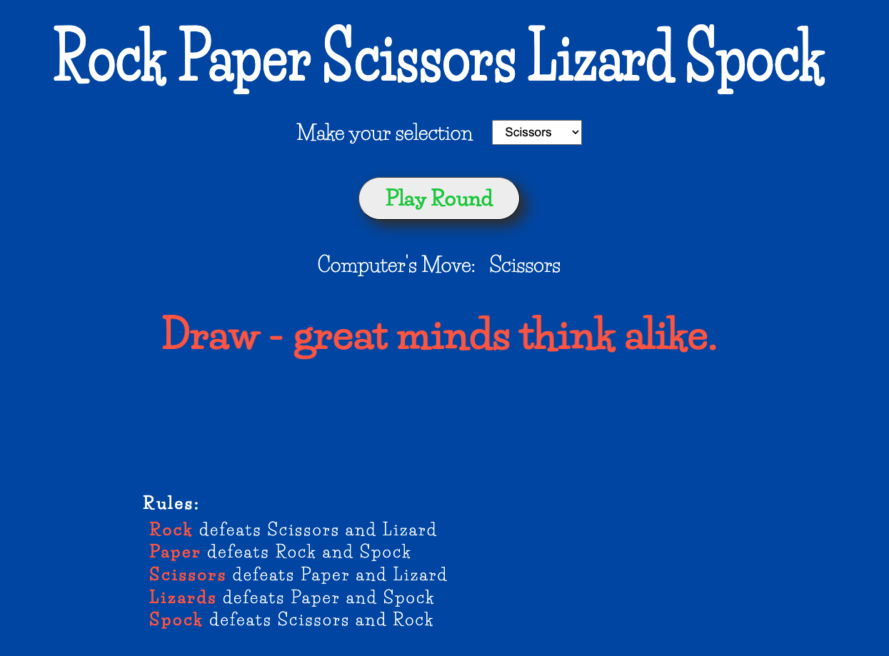
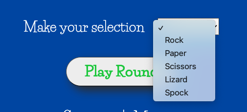

# 🪨📄✂️🦎🖖 Rock Paper Scissors Lizard Spock

A simple, single-page browser game inspired by the classic **Rock Paper Scissors**, extended with **Lizard** and **Spock** for added strategy and fun.

This project focuses on clean game logic, clear UI feedback, and straightforward React state management.

---

## 🎮 Game Overview

Players select one of five options:

- Rock  
- Paper  
- Scissors  
- Lizard  
- Spock  

The computer randomly selects its move, and the result is instantly displayed based on predefined win / lose rules.

---

## 🎯 Objective

- Make a selection
- Click **Play**
- Beat the computer using logical move interactions
- Instantly see the computer’s move and the game result

---

## ✨ Core Features

- 🖱️ One-click move selection
- 🎲 Randomized computer choice
- 🧠 Rule-based outcome calculation
- 📢 Clear result messaging (Win / Lose / Draw)
- 🔁 Instant replayability
- 📱 Responsive, single-page layout

---

## 🛠️ Tech Stack

- **React** — Component-based UI
- **JavaScript (ES6+)** — Game logic
- **HTML5** — Semantic structure
- **CSS3** — Styling and layout

---

## 📸 Game Screenshots

- Title / Landing Screen  

- Player Selection Interface  

- Play Button Interaction  

- Computer’s Move Display  

- Result Output Screen  

---

## 🎯 Project Purpose

This project was built to:

- Practice clean conditional game logic
- Reinforce React state handling
- Create a polished but lightweight interactive game
- Serve as a reusable template for simple browser-based games

---

## 🚀 Possible Enhancements

- Score tracking
- Animations and transitions
- Sound effects
- Multiplayer mode
- Mobile gesture support

---

## 🔗 Live & Source

Check out the live demo and source code below:

- **GitHub Repository:**  
  https://github.com/Blynx03/rock-paper-scissors-lizard-spock
